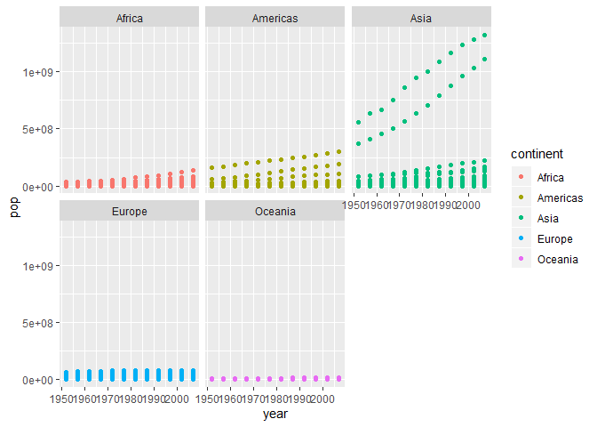

## Participation Make-Up

    ## -- Attaching packages ----------------------------------------- tidyverse 1.2.1 --

    ## v tibble  2.1.3     v purrr   0.3.2
    ## v tidyr   0.8.3     v dplyr   0.8.3
    ## v readr   1.3.1     v stringr 1.4.0
    ## v tibble  2.1.3     v forcats 0.4.0

    ## -- Conflicts -------------------------------------------- tidyverse_conflicts() --
    ## x dplyr::filter() masks stats::filter()
    ## x dplyr::lag()    masks stats::lag()

### Basic ggplot 2 Figure

``` r
ggplot(data = gapminder)+
  geom_point(mapping = aes(x = year, y = pop))
```

<!-- -->

### Adding in Third Dimension Through Aesthetics

``` r
ggplot(data = gapminder) + 
  geom_point(mapping = aes(x = year, y = pop, color = continent))
```

<!-- -->

``` r
ggplot(data = gapminder) + 
  geom_point(mapping = aes(x = year, y = pop, size = continent))
```

<!-- -->

``` r
ggplot(data = gapminder) + 
  geom_point(mapping = aes(x = year, y = pop, shape = continent))
```

<!-- -->

### Faceting

``` r
ggplot(data = gapminder) + 
  geom_point(mapping = aes(x = year, y = pop, color = continent)) + 
  facet_wrap(~ continent, nrow = 2)
```

<!-- -->

### Adding in Smoothed Line

``` r
ggplot(data = gapminder) + 
  geom_smooth(mapping = aes(x = year, y = pop, color = continent))
```

    ## `geom_smooth()` using method = 'loess' and formula 'y ~ x'

<!-- -->

``` r
ggplot(data = gapminder, mapping = aes(x = year, y = pop)) + 
  geom_point(mapping = aes(color = continent)) + 
  geom_smooth()
```

    ## `geom_smooth()` using method = 'gam' and formula 'y ~ s(x, bs = "cs")'

<!-- -->

### Flipping Coordinate System

``` r
ggplot(data = gapminder , mapping=  aes(x= continent, y = lifeExp)) +
  geom_boxplot()
```

<!-- -->

``` r
ggplot(data = gapminder , mapping=  aes(x= continent, y = lifeExp)) +
  geom_point()+
  geom_boxplot() + 
  coord_flip()
```

<!-- -->

### Converting One Coordinate to a Log

``` r
gapminder %>% 
  group_by(year, continent) %>% 
  summarise(pop = sum(pop)) %>% 
ggplot(data = ., mapping = aes(x = year, y = pop, color = continent)) +
  geom_point() +
  scale_y_log10()
```

<!-- -->
